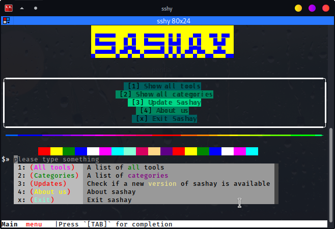
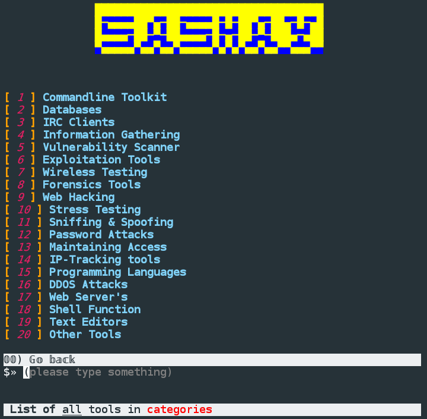

<h1>Sashay</h2>

[](https://github.com/gerrishons)
---
[](https://pepy.tech/project/sashay)
[](https://badge.fury.io/py/sashay)
[](https://pypi.com/project/sashay)
[](https://pypi.com/project/sashay)
[](https://opensource.org/licenses/MIT)
[](https://github.com/scalabli/sashay/stargazers)
[](https://github.com/viewerdiscretion/sashay/network/members)
[](https://github.com/viewerdiscretion/sashay/issues)
[](https://github.com/viewerdiscretion/sashay/watchers)
[](https://www.python.org)
[](https://twitter.com/gerrishon_s)


### Introduction
> :information_source: Sashay is an all in one automatic installer for useful Linux based tools.There are over 340 tools available. 

## Installation⬇️

```console

pip install -U sashay

```

<br>
<p align="center">


</p>

## Tool Categories 
`Information Gathering`
`Vulnerability Scanner`
`Exploitation Tools`
`Wireless Testing`
`Forensics Tools`
`Web Hacking`
`Stress Testing`
`Sniffing & Spoofing`
`Password Attacks`
`Maintaining Access`
`IP-tracking Tools`
`Programming Languages`
`DDOS Attacks`
`Web Servers`
`Distros`


## How to use👨‍💻

Type **`sashay`** or **`sshy`** from anywhere in your terminal

Press `[TAB]` to show  completion, each number represents a specific output:

:bulb: `1` to show all available tools. Type the number corresponding number of a tool which you want to install.

:bulb: `2` to show tools categories

:bulb: `3` to  update sashay

:bulb: `4` to know more about sashay

:bulb: `x` to exit Sashay

- You can also type the numbers manualy intested of pressing `[TAB]`

## Requirements
* Python **3.8+**

## Contributing

If you run into an issue, we would be very happy if you would file a bug on the [issue tracker](https://github.com/scalabli/sashay/issues). You can also contribute by adding more tools by creating a pull request

## License

sashay is released under MIT License

 


### Donate

* <a href="https://ko-fi.com/scalabli" target="_blank"></a>


------------------------------------------------------------------------

## Check more tools 

[Scalabli](https://github.com/scalabli/). 
